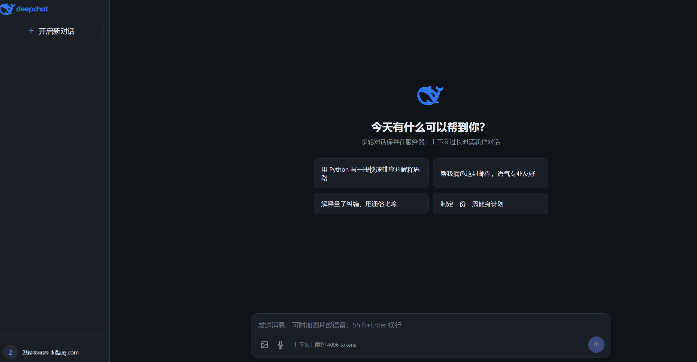

# 🐋 local-llm-stack

**Local deployment on a single RTX 4060 GPU**

**一个一键部署的，包含前端后端数据库的本地LLM**

**在自有 GPU 上运行的私有化多模态聊天平台** —— 将 **vLLM 本地推理**、**FastAPI 后端**、**React 对话前端**、**PostgreSQL 持久化**、**Nginx 反向代理**、**ngrok 内网穿透** 整合为一套可一键部署的完整方案。数据与模型推理均留在本机（WSL 环境），无需依赖云端大模型 API，适合个人实验、内网演示与小团队自用。

---

## 📖 项目简介

my-vllm 面向「**Windows + WSL2 + NVIDIA GPU**」这一常见开发机形态设计：在 **WSL** 中运行 Web 服务、vLLM 推理与 Nginx 反向代理；在 **Windows Docker** 中运行 PostgreSQL，通过 `127.0.0.1:5432` 跨边界访问。用户通过浏览器完成注册登录、多轮对话管理，支持可选模型，支持上传图片等多模态模型 **Qwen2-VL** 图文理解；对话记录按用户隔离存入数据库，支持 **SSE 流式输出** 与 Markdown 渲染。

与「前端调 OpenAI 兼容接口 + 外购数据库」的拼装方案不同，本仓库强调 **单仓库、单进程推理、脚本化运维**：从 `install_dependencies.sh` 安装依赖，到 `start-dev.sh` 启动应用，再到 `run-nginx-and-ngrok.sh` 暴露公网，路径清晰、配置集中（密钥仅在 `.env`，其余默认值在 `fastapi_service/config.py`）。


---

## ✨ 特色

| 维度 | 说明 |
|------|------|
| 🔒 **数据主权** | 推理在本机 vLLM 完成，对话落库自建 PostgreSQL，不经过第三方 LLM SaaS。 |
| 🖼️ **多模态一体** | 默认支持 Qwen2-VL 图文对话（图片 base64 上传 + `qwen-vl-utils` 预处理），纯文本可切换更小模型省显存。 |
| ⚡ **流式体验** | 前后端 SSE；Nginx 对 `/api/chat` 关闭缓冲，避免流式被代理截断。 |
| 🧠 **显存自适应** | 启动 vLLM 前按 `nvidia-smi` 空闲显存自动下调 `gpu_memory_utilization`，缓解 Windows/WSL 共享 GPU 的 OOM。 |
| 🧩 **配置分层** | Pydantic `BaseSettings`：非敏感默认进 Git，`.env` 仅放密钥，便于协作与安全。 |
| 🛠️ **脚本化运维** | `install_dependencies.sh` 一键装 apt + venv `my-vllm` + 前端 + Nginx；`check-pg` / `test-stack` 可脚本验收。 |
| 🔀 **反向代理** | Nginx 统一 `:80` 入口，转发 `:8101`，长连接与 SSE 超时已调优。 |
| 🌐 **穿透公网** | 内置 ngrok 启动脚本，开发演示无需自建隧道；亦可接 Cloudflare Tunnel。 |
| 📦 **单体交付** | FastAPI 同时提供 `/api/*` 与 React 静态资源，减少多服务编排成本。 |

---

## 🏗️ 架构与数据流

```
用户浏览器（注册 / 登录 / 聊天）
          ↓
ngrok 或 Cloudflare Tunnel 内网穿透
          ↓
Nginx 反向代理 80 端口
  ├─ 负载均衡
  ├─ 安全头
  └─ 处理 HTTP 协议
          ↓
转发至后端 8101 端口
          ↓
FastAPI（JWT、对话 CRUD、/api/chat） + React 前端
          ↓
          ├─→ PostgreSQL（Windows Docker，对话持久化）
          └─→ vLLM 本地部署模型
```

### 🪟 为何用 WSL + Windows 分工？

| 选择 | 原因                                                                                        |
|------|-------------------------------------------------------------------------------------------|
| **WSL 跑 vLLM / FastAPI / Nginx / ngrok** | Linux 是 CUDA + vLLM 的主战场；依赖与社区示例均以 Linux 为准；Nginx、ngrok 在 WSL 用 apt 即可。                   |
| **Windows 跑 Docker 里的 PostgreSQL** | 官方推荐开发机装 Docker Desktop；数据库与 WSL 解耦，WSL 重装不丢库；`localhost:5432` 在 WSL 内可直接访问 Windows 映射端口。 |
| **整体仍是一台机器** | GPU 经 WSL2 透传；无需额外服务器，适合本地私有化部署与演示。                                                       |

| 组件 | 端口 | 运行位置 |
|------|------|----------|
| React 静态资源 | 经 Nginx `/` | WSL |
| FastAPI + vLLM | 8101 | WSL |
| Nginx | 80 | WSL |
| ngrok | 可选 | WSL |
| PostgreSQL | 5432 | Windows Docker |


---

## 💻 本地环境

在 **WSL2** 运行 Web + vLLM + Nginx；**PostgreSQL** 在 Windows Docker（`127.0.0.1:5432`）。

### 📦 一次性准备

**1️⃣ WSL 依赖**

```bash
chmod +x scripts/install_dependencies.sh scripts/run-nginx-and-ngrok.sh
./scripts/install_dependencies.sh
```

安装：apt（nginx、nodejs、npm、ngrok 等）、虚拟环境 **`~/.virtualenvs/my-vllm`**、vLLM、`requirements.txt`、Qwen2-VL 时 `qwen-vl-utils`、前端 `npm ci`、Nginx 站点。

跳过 vLLM：`./scripts/install_dependencies.sh --skip-vllm`

**2️⃣ PostgreSQL（Windows PowerShell）**
首先安装docker desktop
```powershell
docker run --name pg -e POSTGRES_PASSWORD=你的密码 -p 5432:5432 -d postgres:16
docker exec -it pg psql -U postgres -c "CREATE DATABASE my_vllm;"
```

**3️⃣ 🔐 `.env`（仅密钥）**
```bash
cp .env.example .env
# 编辑 .env：DATABASE_URL、JWT_SECRET、HF_TOKEN、NGROK_TOKEN 等
```

非密钥默认值在 [`fastapi_service/config.py`](fastapi_service/config.py)（模型、显存、JWT 过期等）。

**4️⃣ 🌐 Nginx / ngrok**

`install_dependencies.sh` 已配置 Nginx；公网隧道执行 `./scripts/run-nginx-and-ngrok.sh`（需 `.env` 中 `NGROK_TOKEN`）。

---

## 📜 脚本一览

| 脚本 | 作用 |
|------|------|
| **`install_dependencies.sh`** | apt + venv `my-vllm` + pip + 前端 + Nginx |
| **`start-dev.sh`** | `build-react.sh` 构建 dist → `run-fastapi.sh` 后台 `:8101`；`--rebuild` 强制重建前端 |
| **`start-prod.sh`** | `run-nginx-and-ngrok.sh` → `build-react.sh` → `run-fastapi.sh`；`--rebuild` 强制重建前端 |
| `run-fastapi.sh` | 仅后端（无 dist 时只有 `/docs`） |
| `build-react.sh` | 仅构建 `frontend/dist`（由 FastAPI 同源托管，无需代理） |
| `run-nginx-and-ngrok.sh` | Nginx + ngrok |
| `setup-nginx.sh` | 配置 Nginx 站点 |
| `stop-nginx.sh` | 禁用 Nginx 站点 |
| `check-pg.sh` | 检测 PostgreSQL |
| `test-stack.sh` | Nginx 冒烟测试 |
| `test-vl-chat.sh` | 图文对话测试 |

---

## 🚀 启动方式

### 🧪 dev（本机）
```powershell
docker start pg
```

```bash
sudo lsof -ti:8101 | xargs -r kill -9
./scripts/start-dev.sh              # 构建 dist + 启动 :8101（UI 与 API 同源）
./scripts/start-dev.sh --rebuild    # 强制 npm build
tail -f .local/uvicorn.log          # 模型加载

# 分开用
./scripts/run-fastapi.sh            # 只后端 → /docs
./scripts/build-react.sh              # 只构建 dist（改完前端需 rebuild 或 --rebuild）
./scripts/build-react.sh --rebuild
```

### 🚢 正式（Nginx + ngrok）

```powershell
docker start pg
```

```bash
sudo lsof -ti:8101 | xargs -r kill -9
./scripts/start-prod.sh              # Nginx/ngrok → 构建 → FastAPI（脚本末尾跟随后端启动日志）
./scripts/start-prod.sh --rebuild    # 强制重建前端
```

在 `.env` 中设置 `NGROK_TOKEN` 后，脚本会执行 `ngrok config add-authtoken` 并后台 `ngrok http 80`（日志 `.local/ngrok.log`）。未设置则只启动 Nginx。也可选用 **cloudflared** 等国际网络隧道。

---

## 🧪 本地诊断

```bash
python test/gpu-test.py    # CUDA / cuDNN 环境
python test/vllm-test.py     # 离线 vLLM 对话
```

---

## ❓ 常见问题

| 现象 | 处理 |
|------|------|
| **`Connection refused`（数据库）** | `docker start pg`，核对 `.env` 中 `DATABASE_URL` 密码 |
| **`Method Not Allowed`** | `kill $(cat .local/uvicorn.pid)` 后重新 `./scripts/start-dev.sh` |
| **Nginx 未监听 80** | `sudo ./scripts/setup-nginx.sh` |
| **ngrok `ERR_NGROK_3200` offline** | 多为 FastAPI 未起来：看 `.local/uvicorn.log`、`.local/crash-latest.log`；`curl -s http://127.0.0.1:8101/health` |
| **ngrok 未启动** | 检查 `NGROK_TOKEN` 与 `.local/ngrok.log` |
| **无 `crash-latest.log`** | SIGKILL(OOM) 无法 trap；现由启动脚本在进程早退时写入；仍可看 `uvicorn.log` 尾部 |
| **显存不足 / OOM** | 降低 `config.py` 中 `vllm_gpu_memory_utilization`（如 `0.4`）；或换 `Qwen3-0.6B` 纯文本模型 |
| **curl 返回空 / `000`** | 进程已挂：`kill -0 $(cat .local/uvicorn.pid)`；多为 vLLM 预加载 OOM；降 `VLLM_GPU_MEMORY_UTILIZATION` 或 `VLLM_MAX_MODEL_LEN` |
| **服务未响应** | 看 `.local/uvicorn.log`；`kill $(cat .local/uvicorn.pid)` 后重新 `./scripts/start-dev.sh` |
| **模型加载慢** | 启动时预加载 vLLM，约 3～4 分钟；前端会显示「正在加载模型」 |

---

## 🏷️ 版本

| Tag | 说明 |
|-----|------|
| **v0.3** | 注册认证、数据库对话持久化、React、流式、Nginx反向代理 Ngrok内网穿透、多模态图文、脚本化安装|

---

## 许可证

本项目采用 [GNU Affero General Public License v3.0](LICENSE)（AGPL-3.0）。
